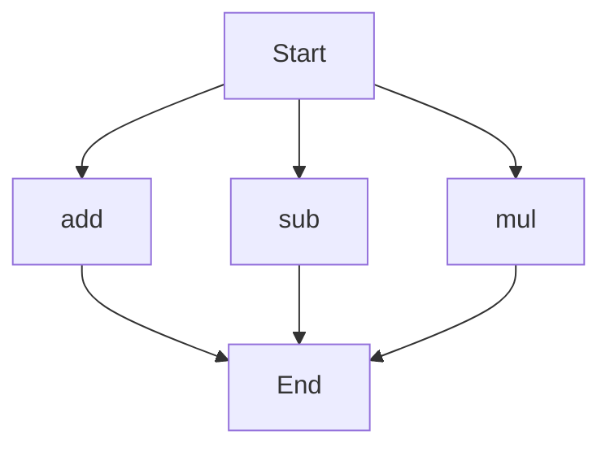

# API Documentation
## calculator.py
The calculator.py file contains a collection of mathematical functions to perform basic arithmetic operations. 

### add(a, b)
#### Description
The `add` function calculates the sum of two numbers.
#### Parameters
* `a` (int/float): The first number to be added.
* `b` (int/float): The second number to be added.
#### Returns
* `int/float`: The sum of `a` and `b`.
#### Example
```python
result = add(5, 7)
print(result)  # Output: 12
```

### sub(c, d)
#### Description
The `sub` function calculates the difference of two numbers.
#### Parameters
* `c` (int/float): The first number.
* `d` (int/float): The second number to be subtracted from the first.
#### Returns
* `int/float`: The difference of `c` and `d`.
#### Example
```python
result = sub(10, 4)
print(result)  # Output: 6
```

### mul(a, b)
#### Description
The `mul` function calculates the product of two numbers.
#### Parameters
* `a` (int/float): The first number to be multiplied.
* `b` (int/float): The second number to be multiplied.
#### Returns
* `int/float`: The product of `a` and `b`.
#### Example
```python
result = mul(5, 6)
print(result)  # Output: 30
```

Since the calculator.py file has more than one function, the execution flow can be represented as follows:

```mermaid
flowchart TD
    A[Start] --> B[add]
    A --> C[sub]
    A --> D[mul]
    B --> E[End]
    C --> E
    D --> E
```
This flowchart demonstrates the various entry points into the calculator module, depending on the desired mathematical operation. 

Note: There are no classes or variables in the provided code snippet, so no documentation for those is included. 

When run directly, this script does not have a main block or any module-level code that executes, so there is no description for that.