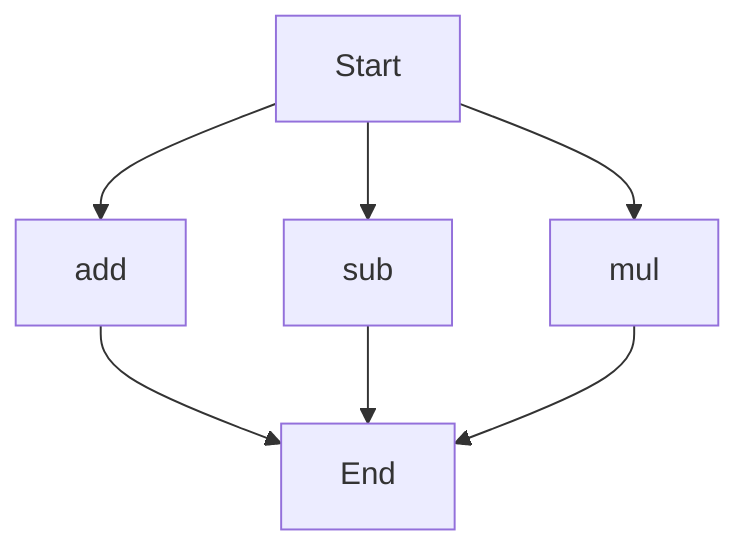

# API Documentation

## calculator.py
The calculator.py file contains a set of basic mathematical functions. 

### add(a, b)
#### Description
The add function takes two numbers as input and returns their sum.

#### Parameters
* `a` (int or float): The first number to be added.
* `b` (int or float): The second number to be added.

#### Returns
* `result` (int or float): The sum of `a` and `b`.

#### Example
```python
result = add(5, 7)
print(result)  # Outputs: 12
```

### sub(c, d)
#### Description
The sub function takes two numbers as input and returns their difference.

#### Parameters
* `c` (int or float): The first number.
* `d` (int or float): The second number to be subtracted from the first.

#### Returns
* `result` (int or float): The difference of `c` and `d`.

#### Example
```python
result = sub(10, 4)
print(result)  # Outputs: 6
```

### mul(a, b)
#### Description
The mul function takes two numbers as input and returns their product.

#### Parameters
* `a` (int or float): The first number to be multiplied.
* `b` (int or float): The second number to be multiplied.

#### Returns
* `result` (int or float): The product of `a` and `b`.

#### Example
```python
result = mul(5, 7)
print(result)  # Outputs: 35
```

Since the calculator.py file contains more than one function, the following flowchart illustrates the execution flow:

```mermaid
flowchart TD
    A[Start] --> B[add]
    A --> C[sub]
    A --> D[mul]
    B --> E[End]
    C --> E
    D --> E
```
Note that the flowchart shows the potential paths of execution for the functions in calculator.py, assuming each function can be called independently from the start. In a real-world scenario, the actual execution flow may vary based on how these functions are utilized within a larger program.