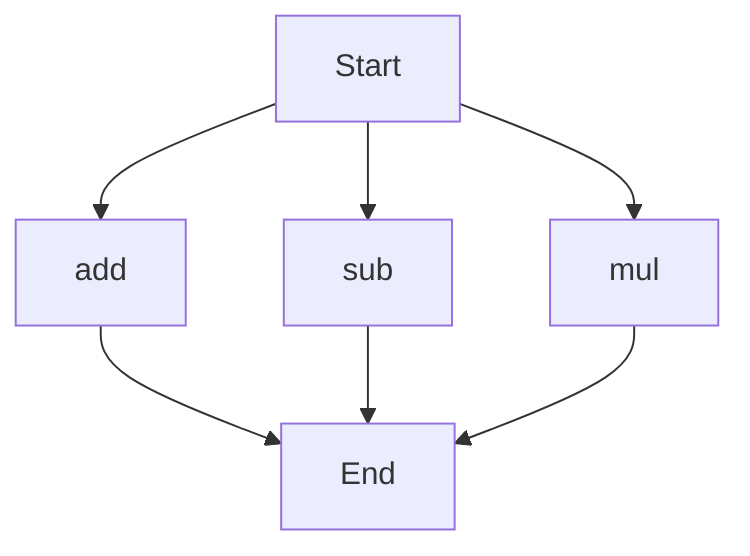

# agentic-test-repo

Auto-documented by Agentic AI Documentation Maintainer.

---

# API Documentation
## calculator.py
The calculator.py module provides basic arithmetic operations.

### Functions
#### add(a, b)
##### Description
The `add` function takes two numbers as input and returns their sum.
##### Parameters
* `a` (int or float): The first number to add.
* `b` (int or float): The second number to add.
##### Returns
* `int` or `float`: The sum of `a` and `b`.
##### Example
```python
result = add(5, 3)
print(result)  # Outputs: 8
```

#### sub(c, d)
##### Description
The `sub` function takes two numbers as input and returns their difference.
##### Parameters
* `c` (int or float): The first number to subtract from.
* `d` (int or float): The second number to subtract.
##### Returns
* `int` or `float`: The difference of `c` and `d`.
##### Example
```python
result = sub(10, 4)
print(result)  # Outputs: 6
```

#### mul(a, b)
##### Description
The `mul` function takes two numbers as input and returns their product.
##### Parameters
* `a` (int or float): The first number to multiply.
* `b` (int or float): The second number to multiply.
##### Returns
* `int` or `float`: The product of `a` and `b`.
##### Example
```python
result = mul(5, 6)
print(result)  # Outputs: 30
```

### Execution Flow
Since there are multiple functions in the calculator.py module, the following flowchart illustrates the execution flow:

Note: The flowchart shows the possible execution paths for each function, but the actual execution flow depends on the specific use case and how the functions are called. 

### Module-Level Code
When run directly, the calculator.py module does not have any specific functionality, as it only contains function definitions. To use the functions, import the module in another script and call the desired functions. For example:
```python
from calculator import add, sub, mul

result_add = add(5, 3)
result_sub = sub(10, 4)
result_mul = mul(5, 6)

print(result_add)  # Outputs: 8
print(result_sub)   # Outputs: 6
print(result_mul)   # Outputs: 30
```

---

*Last updated automatically by AI on every code push.*
