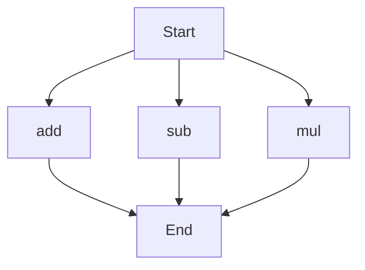

# agentic-test-repo

Auto-documented by Agentic AI Documentation Maintainer.

---

# API Documentation

## calculator.py
The calculator.py file contains a set of mathematical functions to perform basic arithmetic operations. 

### add(a, b)
#### Description
The `add` function calculates the sum of two numbers.
#### Parameters
* `a` (int/float): The first number to add.
* `b` (int/float): The second number to add.
#### Returns
The sum of `a` and `b`.
#### Example
```python
result = add(5, 3)
print(result)  # Outputs: 8
```

### sub(c, d)
#### Description
The `sub` function calculates the difference of two numbers.
#### Parameters
* `c` (int/float): The first number.
* `d` (int/float): The second number to subtract from the first.
#### Returns
The difference of `c` and `d`.
#### Example
```python
result = sub(10, 4)
print(result)  # Outputs: 6
```

### mul(a, b)
#### Description
The `mul` function calculates the product of two numbers.
#### Parameters
* `a` (int/float): The first number to multiply.
* `b` (int/float): The second number to multiply.
#### Returns
The product of `a` and `b`.
#### Example
```python
result = mul(5, 6)
print(result)  # Outputs: 30
```

Since the calculator.py file has more than one function, the following flowchart illustrates the execution flow:

Note: This flowchart is a simple representation and does not imply any specific order of function calls, as these functions can be called independently. 

When run directly, this script does not have a main block or any print statements, so it does not perform any specific actions on its own. It is intended to be imported as a module in other Python scripts to utilize its functions.

---

*Last updated automatically by AI on every code push.*
