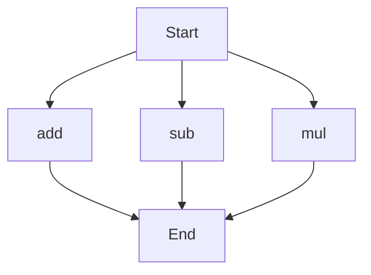

# agentic-test-repo

Auto-documented by Agentic AI Documentation Maintainer.

---

# API Documentation

## calculator.py
The calculator.py file contains a set of mathematical functions for basic arithmetic operations.

### add(a, b)
#### Description
The `add` function calculates the sum of two numbers.

#### Parameters
* `a` (int or float): The first number to be added.
* `b` (int or float): The second number to be added.

#### Returns
The sum of `a` and `b`.

#### Example
```python
result = add(5, 7)
print(result)  # Output: 12
```

### sub(c, d)
#### Description
The `sub` function calculates the difference between two numbers.

#### Parameters
* `c` (int or float): The first number.
* `d` (int or float): The second number to be subtracted.

#### Returns
The difference between `c` and `d`.

#### Example
```python
result = sub(10, 4)
print(result)  # Output: 6
```

### mul(a, b)
#### Description
The `mul` function calculates the product of two numbers.

#### Parameters
* `a` (int or float): The first number to be multiplied.
* `b` (int or float): The second number to be multiplied.

#### Returns
The product of `a` and `b`.

#### Example
```python
result = mul(6, 8)
print(result)  # Output: 48
```

Since the calculator.py file contains more than one function, the following Mermaid flowchart illustrates the execution flow:

Note: The flowchart shows the possible execution paths for each function, but it does not imply a specific order of execution, as this depends on the actual usage of the functions in the code.

---

*Last updated automatically by AI on every code push.*
