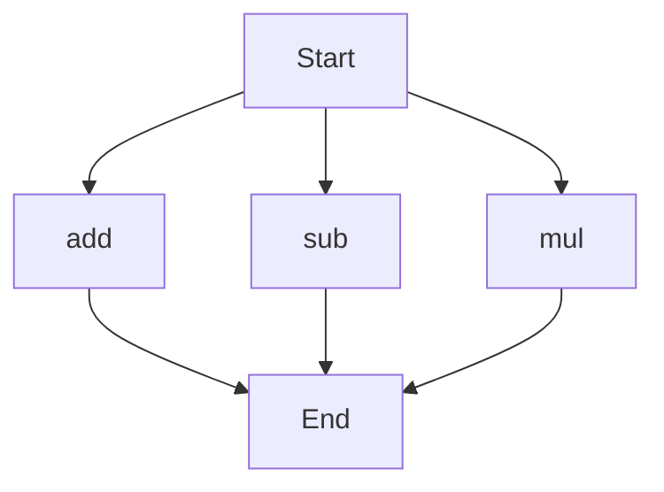

# agentic-test-repo

Auto-documented by Agentic AI Documentation Maintainer.

---

# API Documentation
## calculator.py
The calculator.py file contains a set of functions for basic arithmetic operations.

### add(a, b)
#### Description
The `add` function calculates the sum of two numbers.
#### Parameters
* `a` (number): The first number to add.
* `b` (number): The second number to add.
#### Returns
The sum of `a` and `b`.
#### Example
```python
result = add(5, 3)
print(result)  # Outputs: 8
```

### sub(c, d)
#### Description
The `sub` function calculates the difference of two numbers.
#### Parameters
* `c` (number): The first number.
* `d` (number): The second number to subtract from the first.
#### Returns
The difference of `c` and `d`.
#### Example
```python
result = sub(10, 4)
print(result)  # Outputs: 6
```

### mul(a, b)
#### Description
The `mul` function calculates the product of two numbers.
#### Parameters
* `a` (number): The first number to multiply.
* `b` (number): The second number to multiply.
#### Returns
The product of `a` and `b`.
#### Example
```python
result = mul(7, 2)
print(result)  # Outputs: 14
```

Since there are multiple functions in this file, the following flowchart illustrates the execution flow:

Note: This flowchart represents the individual execution paths of each function. In a real-world scenario, the actual execution flow may vary based on how these functions are called and used within the program. 

There are no classes or variables defined in this file. When run directly, this script does not execute any code as it only contains function definitions.

---

*Last updated automatically by AI on every code push.*
