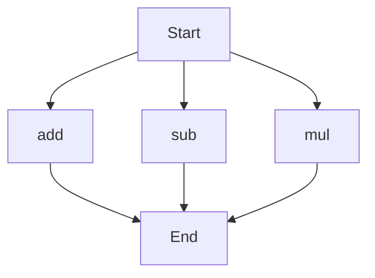

# agentic-test-repo

Auto-documented by Agentic AI Documentation Maintainer.

---

# API Documentation
## calculator.py
The calculator.py file contains a set of functions for basic arithmetic operations. 

### add(a, b)
#### Description
The `add` function calculates the sum of two numbers.
#### Parameters
* `a` (int or float): The first number to add.
* `b` (int or float): The second number to add.
#### Returns
The sum of `a` and `b`.
#### Example
```python
result = add(5, 7)
print(result)  # Outputs: 12
```

### sub(c, d)
#### Description
The `sub` function calculates the difference of two numbers.
#### Parameters
* `c` (int or float): The first number.
* `d` (int or float): The second number to subtract.
#### Returns
The difference of `c` and `d`.
#### Example
```python
result = sub(10, 4)
print(result)  # Outputs: 6
```

### mul(a, b)
#### Description
The `mul` function calculates the product of two numbers.
#### Parameters
* `a` (int or float): The first number to multiply.
* `b` (int or float): The second number to multiply.
#### Returns
The product of `a` and `b`.
#### Example
```python
result = mul(5, 6)
print(result)  # Outputs: 30
```

Since there are multiple functions in this file, the execution flow can be represented as follows:

Note: The execution flow assumes that the functions can be called independently, and the order of execution may vary based on the specific use case. 

When run directly, this script does not have any specific behavior as it only contains function definitions. To use these functions, you would need to import this module in another script or call the functions directly after defining them in the same script.

---

*Last updated automatically by AI on every code push.*
