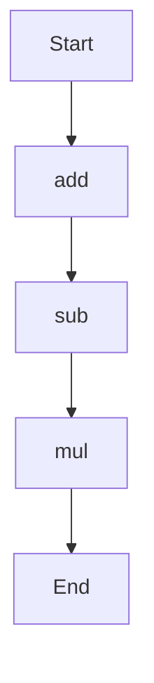

# agentic-test-repo

Auto-documented by Agentic AI Documentation Maintainer.

---

# API Documentation

## calculator.py
The calculator.py file contains a set of mathematical functions that can be used to perform basic arithmetic operations.

### Functions
#### add(a, b)
##### Description
The `add` function takes two numbers as input, adds them together, and returns the result.
##### Parameters
* `a` (int or float): The first number to be added.
* `b` (int or float): The second number to be added.
##### Returns
* `int` or `float`: The sum of `a` and `b`.
##### Example
```python
result = add(5, 3)
print(result)  # Output: 8
```

#### sub(c, d)
##### Description
The `sub` function takes two numbers as input, subtracts the second from the first, and returns the result.
##### Parameters
* `c` (int or float): The first number.
* `d` (int or float): The second number to be subtracted.
##### Returns
* `int` or `float`: The difference between `c` and `d`.
##### Example
```python
result = sub(10, 4)
print(result)  # Output: 6
```

#### mul(a, b)
##### Description
The `mul` function takes two numbers as input, multiplies them together, and returns the result.
##### Parameters
* `a` (int or float): The first number to be multiplied.
* `b` (int or float): The second number to be multiplied.
##### Returns
* `int` or `float`: The product of `a` and `b`.
##### Example
```python
result = mul(5, 6)
print(result)  # Output: 30
```

### Flowchart
As there are multiple functions in this file, a flowchart is included to illustrate the execution flow:

Note: The flowchart shows a sequential execution of the functions. However, in a real-world scenario, the execution flow may vary depending on how the functions are called and used. 

This documentation provides a clear overview of the calculator.py file, including its functions, parameters, return types, and examples. The flowchart adds a visual representation of the execution flow, making it easier to understand the relationships between the functions.

---

*Last updated automatically by AI on every code push.*
