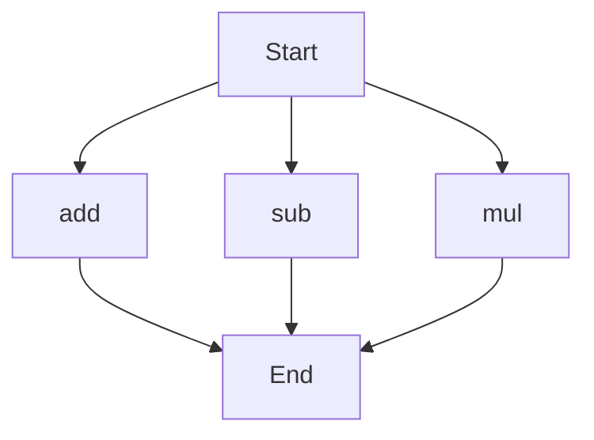

# agentic-test-repo

Auto-documented by Agentic AI Documentation Maintainer.

---

# API Documentation
## calculator.py
### Functions
#### add(a, b)
##### Description
The `add` function calculates the sum of two numbers.
##### Parameters
* `a` (int or float): The first number to add.
* `b` (int or float): The second number to add.
##### Returns
The sum of `a` and `b`.
##### Example
```python
result = add(5, 7)
print(result)  # Output: 12
```

#### sub(c, d)
##### Description
The `sub` function calculates the difference between two numbers.
##### Parameters
* `c` (int or float): The first number.
* `d` (int or float): The second number to subtract.
##### Returns
The difference between `c` and `d`.
##### Example
```python
result = sub(10, 4)
print(result)  # Output: 6
```

#### mul(a, b)
##### Description
The `mul` function calculates the product of two numbers.
##### Parameters
* `a` (int or float): The first number to multiply.
* `b` (int or float): The second number to multiply.
##### Returns
The product of `a` and `b`.
##### Example
```python
result = mul(5, 6)
print(result)  # Output: 30
```

### Execution Flow
Since there are multiple functions in this file, the execution flow can be represented as follows:

Note: The execution flow diagram shows the possible paths of execution when running the `calculator.py` file directly. In a real-world scenario, the actual flow would depend on how the functions are called and used.

### Module-Level Code
When run directly, this script does not have any module-level code that executes. It only defines functions that can be imported and used in other scripts.

---

*Last updated automatically by AI on every code push.*
