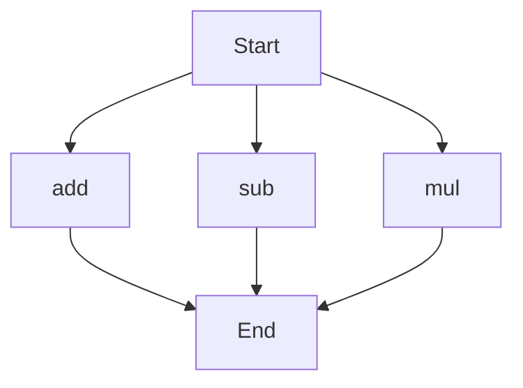

# agentic-test-repo

Auto-documented by Agentic AI Documentation Maintainer.

---

# API Documentation
## calculator.py
The `calculator.py` file contains a set of mathematical functions that can be used for basic arithmetic operations.

### add(a, b)
#### Description
The `add(a, b)` function takes two numbers as input and returns their sum.
#### Parameters
* `a` (number): The first number to be added.
* `b` (number): The second number to be added.
#### Returns
* `number`: The sum of `a` and `b`.
#### Example
```python
result = add(5, 3)
print(result)  # Outputs: 8
```

### sub(c, d)
#### Description
The `sub(c, d)` function takes two numbers as input and returns their difference.
#### Parameters
* `c` (number): The first number.
* `d` (number): The second number to be subtracted from the first.
#### Returns
* `number`: The difference between `c` and `d`.
#### Example
```python
result = sub(10, 4)
print(result)  # Outputs: 6
```

### mul(a, b)
#### Description
The `mul(a, b)` function takes two numbers as input and returns their product.
#### Parameters
* `a` (number): The first number to be multiplied.
* `b` (number): The second number to be multiplied.
#### Returns
* `number`: The product of `a` and `b`.
#### Example
```python
result = mul(7, 2)
print(result)  # Outputs: 14
```

Since there are multiple functions in this file, the execution flow can be represented as follows:

Note that this flowchart does not imply a specific order of execution, but rather shows the possible paths of execution when using these functions. 

There are no classes or variables defined in this file, and there is no module-level code to describe.

---

*Last updated automatically by AI on every code push.*
