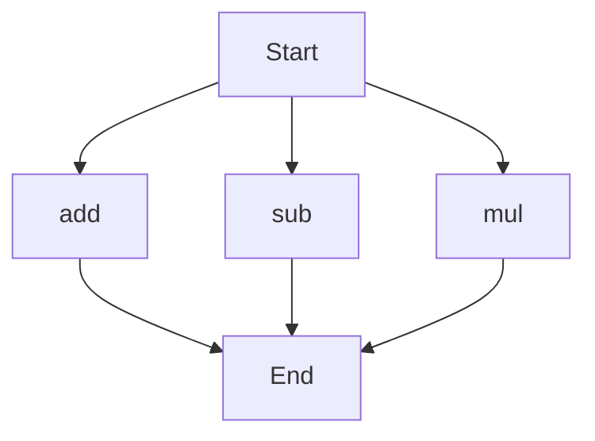

# agentic-test-repo

Auto-documented by Agentic AI Documentation Maintainer.

---

# API Documentation

## calculator.py
The calculator.py module contains a set of functions to perform basic arithmetic operations.

### Functions
#### add(a, b)
##### Description
The `add` function calculates the sum of two numbers.
##### Parameters
* `a` (int or float): The first number to add.
* `b` (int or float): The second number to add.
##### Returns
The sum of `a` and `b`.
##### Example
```python
result = add(3, 5)
print(result)  # Output: 8
```

#### sub(c, d)
##### Description
The `sub` function calculates the difference between two numbers.
##### Parameters
* `c` (int or float): The first number.
* `d` (int or float): The second number to subtract from the first.
##### Returns
The difference between `c` and `d`.
##### Example
```python
result = sub(10, 4)
print(result)  # Output: 6
```

#### mul(a, b)
##### Description
The `mul` function calculates the product of two numbers.
##### Parameters
* `a` (int or float): The first number to multiply.
* `b` (int or float): The second number to multiply.
##### Returns
The product of `a` and `b`.
##### Example
```python
result = mul(4, 5)
print(result)  # Output: 20
```

### Execution Flow
Since there are multiple functions in this module, the execution flow can be represented as follows:

This flowchart illustrates the possible execution paths for the functions in the calculator.py module. Note that the actual execution flow may vary depending on the specific use case and how the functions are called. 

There are no classes or variables in this module, and no module-level code is provided. Therefore, these sections are not included in the documentation.

---

*Last updated automatically by AI on every code push.*
