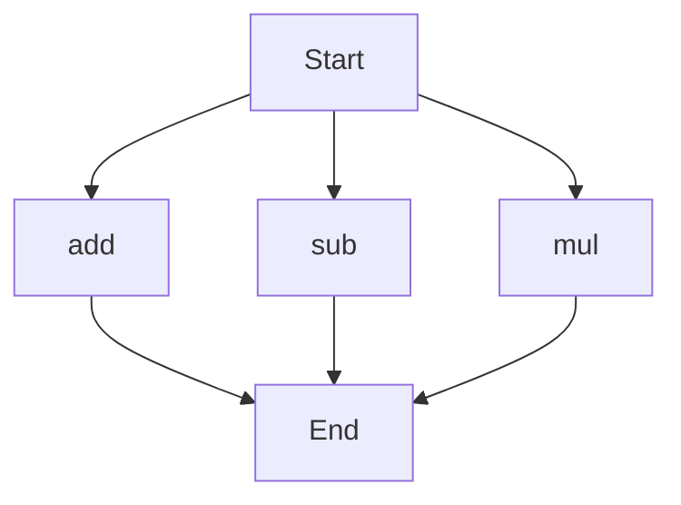

# agentic-test-repo

Auto-documented by Agentic AI Documentation Maintainer.

---

# API Documentation
## calculator.py
The calculator.py file contains a set of arithmetic functions that can be used to perform basic mathematical operations.

### add(a, b)
#### Description
The `add` function takes two numbers as input and returns their sum.
#### Parameters
* `a` (int/float): The first number to be added.
* `b` (int/float): The second number to be added.
#### Returns
* `int/float`: The sum of `a` and `b`.
#### Example
```python
result = add(5, 7)
print(result)  # Output: 12
```

### sub(c, d)
#### Description
The `sub` function takes two numbers as input and returns their difference.
#### Parameters
* `c` (int/float): The first number.
* `d` (int/float): The second number to be subtracted from the first.
#### Returns
* `int/float`: The difference between `c` and `d`.
#### Example
```python
result = sub(10, 4)
print(result)  # Output: 6
```

### mul(a, b)
#### Description
The `mul` function takes two numbers as input and returns their product.
#### Parameters
* `a` (int/float): The first number to be multiplied.
* `b` (int/float): The second number to be multiplied.
#### Returns
* `int/float`: The product of `a` and `b`.
#### Example
```python
result = mul(5, 6)
print(result)  # Output: 30
```

Since the calculator.py file has more than one function, here is a flowchart showing the execution flow:

Note: The flowchart shows the possible execution paths for each function. In a real-world scenario, the actual execution flow would depend on how these functions are called and used in the program. 

When run directly, the calculator.py script does not have a main block or any module-level code that performs a specific task. It only defines the arithmetic functions that can be imported and used in other scripts.

---

*Last updated automatically by AI on every code push.*
