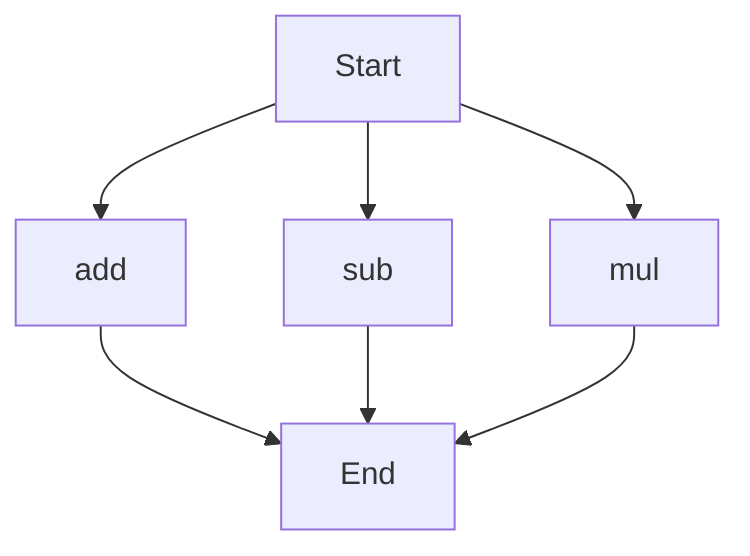

# agentic-test-repo

Auto-documented by Agentic AI Documentation Maintainer.

---

# API Documentation
## calculator.py
The calculator.py file contains a set of functions for basic arithmetic operations.

### add(a, b)
#### Description
The `add` function calculates the sum of two numbers.

#### Parameters
* `a` (int or float): The first number to add.
* `b` (int or float): The second number to add.

#### Returns
The sum of `a` and `b` as an integer or float.

#### Example
```python
result = add(5, 7)
print(result)  # Outputs: 12
```

### sub(c, d)
#### Description
The `sub` function calculates the difference between two numbers.

#### Parameters
* `c` (int or float): The first number.
* `d` (int or float): The second number to subtract from the first.

#### Returns
The difference between `c` and `d` as an integer or float.

#### Example
```python
result = sub(10, 4)
print(result)  # Outputs: 6
```

### mul(a, b)
#### Description
The `mul` function calculates the product of two numbers.

#### Parameters
* `a` (int or float): The first number to multiply.
* `b` (int or float): The second number to multiply.

#### Returns
The product of `a` and `b` as an integer or float.

#### Example
```python
result = mul(6, 8)
print(result)  # Outputs: 48
```

Since there are multiple functions in this file, here's a flowchart showing the execution flow:

This flowchart illustrates that the execution can start with any of the `add`, `sub`, or `mul` functions, and each leads to the end of the execution.

Note that this repository does not include any classes or variables. When run directly, this script does not execute any specific block of code as it only contains function definitions.

---

*Last updated automatically by AI on every code push.*
