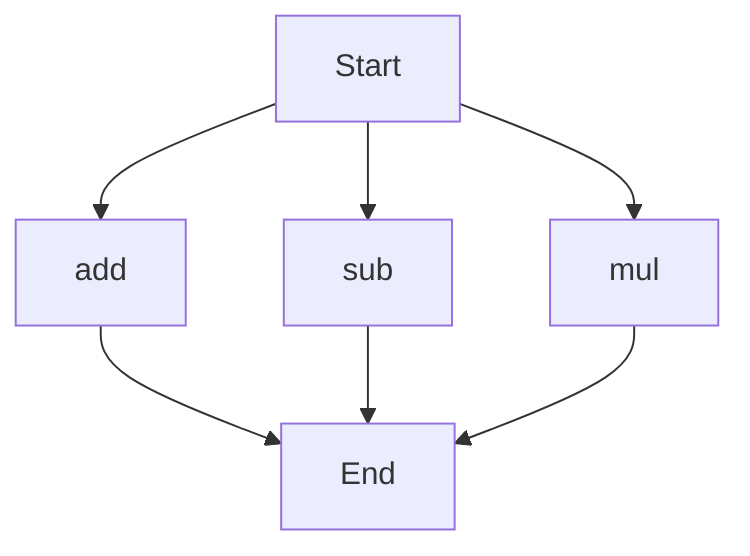

# agentic-test-repo

Auto-documented by Agentic AI Documentation Maintainer.

---

# API Documentation

## calculator.py
### Overview
This module provides basic arithmetic operations.

### Functions

#### add(a, b)
##### Description
This function adds two numbers together.
##### Parameters
* `a` (int or float): The first number to add.
* `b` (int or float): The second number to add.
##### Returns
The sum of `a` and `b`.
##### Example
```python
result = add(5, 3)
print(result)  # Output: 8
```

#### sub(c, d)
##### Description
This function subtracts one number from another.
##### Parameters
* `c` (int or float): The first number.
* `d` (int or float): The number to subtract from `c`.
##### Returns
The difference between `c` and `d`.
##### Example
```python
result = sub(10, 4)
print(result)  # Output: 6
```

#### mul(a, b)
##### Description
This function multiplies two numbers together.
##### Parameters
* `a` (int or float): The first number to multiply.
* `b` (int or float): The second number to multiply.
##### Returns
The product of `a` and `b`.
##### Example
```python
result = mul(5, 3)
print(result)  # Output: 15
```

### Execution Flow

This flowchart shows that the execution of the script can start with any of the three functions (`add`, `sub`, `mul`), and each function will return the result without any further dependencies. 

Note: There are no classes or variables in this module, so those sections are not included. Also, there is no module-level code, so that section is not included either.

---

*Last updated automatically by AI on every code push.*
