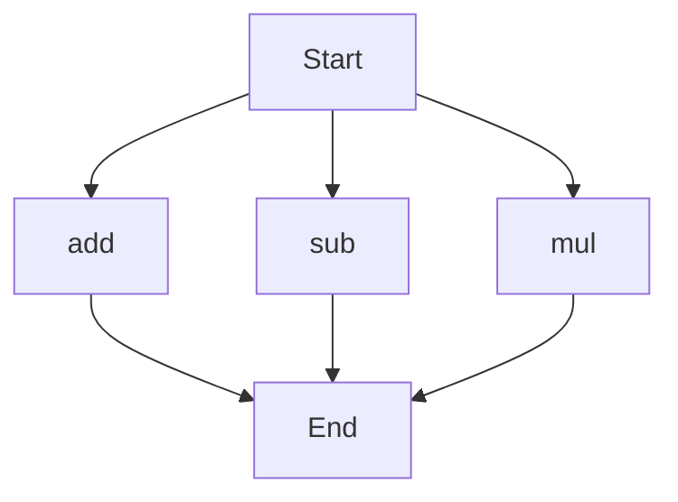

# agentic-test-repo

Auto-documented by Agentic AI Documentation Maintainer.

---

# API Documentation

## calculator.py
This module contains basic arithmetic operations. 

### add(a, b)
#### Description
This function adds two numbers together. It takes in two parameters, adds them, and returns the result.

#### Parameters
* `a` (int or float): The first number to add.
* `b` (int or float): The second number to add.

#### Returns
The sum of `a` and `b`.

#### Example
```python
result = add(5, 7)
print(result)  # Outputs: 12
```

### sub(c, d)
#### Description
This function subtracts one number from another. It takes in two parameters, subtracts the second from the first, and returns the result.

#### Parameters
* `c` (int or float): The number to subtract from.
* `d` (int or float): The number to subtract.

#### Returns
The difference between `c` and `d`.

#### Example
```python
result = sub(10, 4)
print(result)  # Outputs: 6
```

### mul(a, b)
#### Description
This function multiplies two numbers together. It takes in two parameters, multiplies them, and returns the result.

#### Parameters
* `a` (int or float): The first number to multiply.
* `b` (int or float): The second number to multiply.

#### Returns
The product of `a` and `b`.

#### Example
```python
result = mul(6, 8)
print(result)  # Outputs: 48
```

Since this module contains more than one function, here's an overview of the execution flow:

This flowchart illustrates that the module can start with any of the three functions (`add`, `sub`, `mul`), and each function leads to the end of the execution. 

Note: There are no classes or variables in this module, so those sections are not applicable. Additionally, there is no module-level code (like print statements or a main block) to describe.

---

*Last updated automatically by AI on every code push.*
