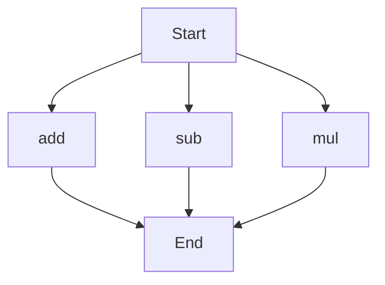

# agentic-test-repo

Auto-documented by Agentic AI Documentation Maintainer.

---

# API Documentation

## calculator.py
This file contains a collection of mathematical functions that can be used to perform basic arithmetic operations.

### add(a, b)
#### Description
The `add` function takes two numbers as input and returns their sum.

#### Parameters
* `a` (int or float): The first number to be added.
* `b` (int or float): The second number to be added.

#### Returns
* The sum of `a` and `b` (int or float).

#### Example
```python
result = add(5, 3)
print(result)  # Outputs: 8
```

### sub(c, d)
#### Description
The `sub` function takes two numbers as input and returns their difference.

#### Parameters
* `c` (int or float): The first number.
* `d` (int or float): The second number to be subtracted from the first.

#### Returns
* The difference between `c` and `d` (int or float).

#### Example
```python
result = sub(10, 4)
print(result)  # Outputs: 6
```

### mul(a, b)
#### Description
The `mul` function takes two numbers as input and returns their product.

#### Parameters
* `a` (int or float): The first number to be multiplied.
* `b` (int or float): The second number to be multiplied.

#### Returns
* The product of `a` and `b` (int or float).

#### Example
```python
result = mul(5, 6)
print(result)  # Outputs: 30
```

Since this file contains more than one function, the execution flow can be represented as follows:

Note that the execution flow is not necessarily sequential, as these functions can be called independently depending on the use case. 

There are no classes or variables in this file. When run directly, this script does not have a main block, so it does not perform any actions on its own. It is intended to be imported as a module in other Python scripts.

---

*Last updated automatically by AI on every code push.*
