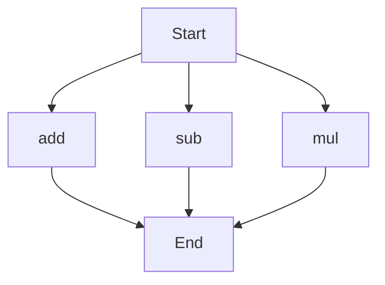

# agentic-test-repo

Auto-documented by Agentic AI Documentation Maintainer.

---

# API Documentation
## calculator.py
### Functions
#### add(a, b)
##### Description
The `add` function takes two parameters, `a` and `b`, and returns their sum.

##### Parameters
* `a` (int or float): The first number to add.
* `b` (int or float): The second number to add.

##### Returns
* `int` or `float`: The sum of `a` and `b`.

##### Example
```python
result = add(5, 3)
print(result)  # Output: 8
```

#### sub(c, d)
##### Description
The `sub` function takes two parameters, `c` and `d`, and returns their difference.

##### Parameters
* `c` (int or float): The first number.
* `d` (int or float): The second number to subtract from the first.

##### Returns
* `int` or `float`: The difference between `c` and `d`.

##### Example
```python
result = sub(10, 4)
print(result)  # Output: 6
```

#### mul(a, b)
##### Description
The `mul` function takes two parameters, `a` and `b`, and returns their product.

##### Parameters
* `a` (int or float): The first number to multiply.
* `b` (int or float): The second number to multiply.

##### Returns
* `int` or `float`: The product of `a` and `b`.

##### Example
```python
result = mul(5, 6)
print(result)  # Output: 30
```

### Execution Flow

Note: The execution flow chart shows the possible entry points for the functions in the `calculator.py` file. The actual execution flow may vary depending on how the functions are called. 

There are no classes or variables in this file, and there is no module-level code, so those sections are not included.

---

*Last updated automatically by AI on every code push.*
