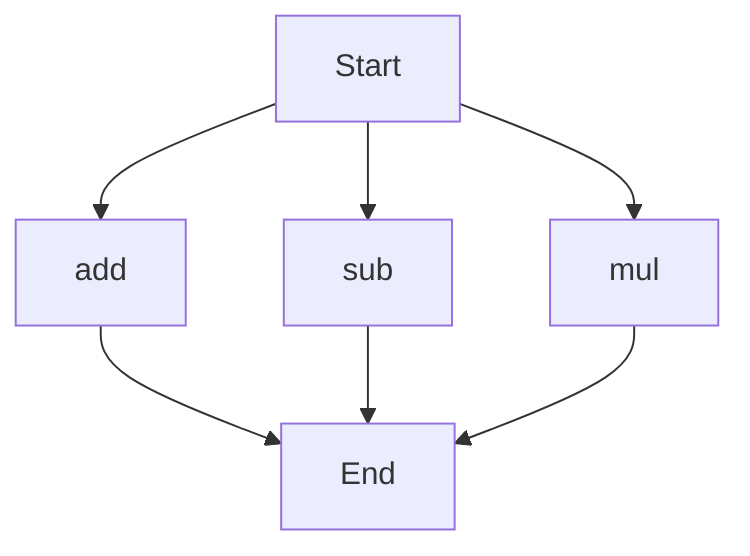

# agentic-test-repo

Auto-documented by Agentic AI Documentation Maintainer.

---

# API Documentation

## calculator.py
### Overview
The calculator.py file contains a set of functions to perform basic arithmetic operations. 

### Functions
#### add(a, b)
##### Description
The `add` function calculates the sum of two numbers.
##### Parameters
* `a` (number): The first number to be added.
* `b` (number): The second number to be added.
##### Returns
The sum of `a` and `b`.
##### Example
```python
result = add(5, 3)
print(result)  # Outputs: 8
```

#### sub(c, d)
##### Description
The `sub` function calculates the difference between two numbers.
##### Parameters
* `c` (number): The first number.
* `d` (number): The second number to be subtracted from the first.
##### Returns
The difference between `c` and `d`.
##### Example
```python
result = sub(10, 4)
print(result)  # Outputs: 6
```

#### mul(a, b)
##### Description
The `mul` function calculates the product of two numbers.
##### Parameters
* `a` (number): The first number to be multiplied.
* `b` (number): The second number to be multiplied.
##### Returns
The product of `a` and `b`.
##### Example
```python
result = mul(7, 2)
print(result)  # Outputs: 14
```

### Execution Flow
Since there are multiple functions in this file, the following flowchart illustrates the execution flow:

Note: The execution flow chart shows the possible paths of execution when using these functions. In a real-world scenario, the actual flow would depend on how these functions are called and used within the program. 

### Module-Level Code
There is no module-level code in this file. The functions can be used by importing this module into another Python script. 

No variables or classes are defined in this file.

---

*Last updated automatically by AI on every code push.*
