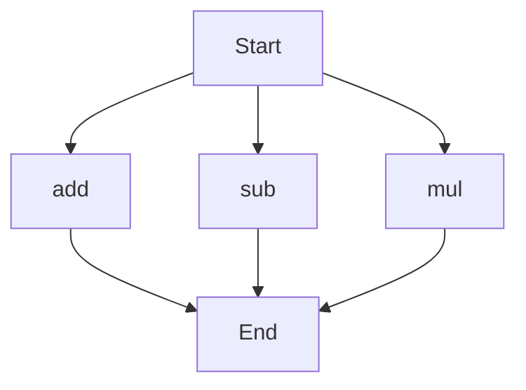

# agentic-test-repo

Auto-documented by Agentic AI Documentation Maintainer.

---

# API Documentation
## calculator.py
The calculator.py file contains a set of basic mathematical functions. When run directly, this script does not have a main block and thus does not execute any specific task on its own.

### Functions
#### add(a, b)
##### Description
The `add` function takes two parameters and returns their sum. It is used for basic arithmetic addition operations.

##### Parameters
* `a` (number): The first number to add.
* `b` (number): The second number to add.

##### Returns
* `result` (number): The sum of `a` and `b`.

##### Example
```python
result = add(5, 7)
print(result)  # Outputs: 12
```

#### sub(c, d)
##### Description
The `sub` function takes two parameters and returns their difference. It is used for basic arithmetic subtraction operations.

##### Parameters
* `c` (number): The first number.
* `d` (number): The second number to subtract from the first.

##### Returns
* `result` (number): The difference between `c` and `d`.

##### Example
```python
result = sub(10, 4)
print(result)  # Outputs: 6
```

#### mul(a, b)
##### Description
The `mul` function takes two parameters and returns their product. It is used for basic arithmetic multiplication operations.

##### Parameters
* `a` (number): The first number to multiply.
* `b` (number): The second number to multiply.

##### Returns
* `result` (number): The product of `a` and `b`.

##### Example
```python
result = mul(5, 6)
print(result)  # Outputs: 30
```

## Execution Flow
Since there are multiple functions in this file, the execution flow can be represented as follows:

Note: The execution flow assumes that each function can be called independently from the start, and they all lead to the end without any specific order or dependency between them.

---

*Last updated automatically by AI on every code push.*
