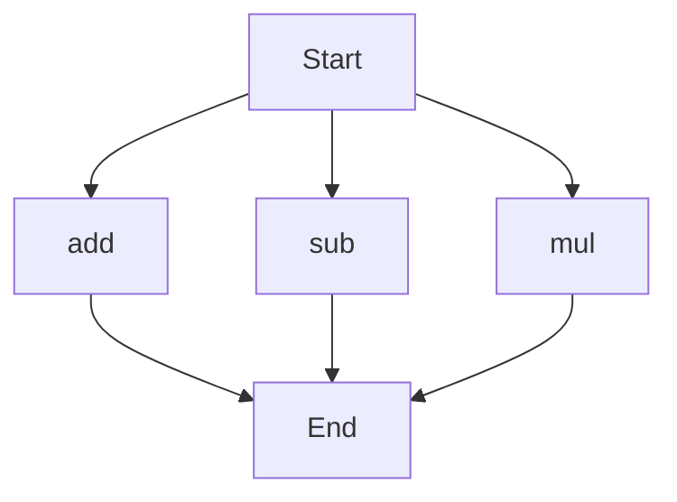

# agentic-test-repo

Auto-documented by Agentic AI Documentation Maintainer.

---

# API Documentation
## calculator.py
The calculator.py file contains a set of basic arithmetic functions.

### Functions
#### add(a, b)
##### Description
The `add` function calculates the sum of two numbers.
##### Parameters
* `a` (int/float): The first number to add.
* `b` (int/float): The second number to add.
##### Returns
* `int/float`: The sum of `a` and `b`.
##### Example
```python
result = add(5, 3)
print(result)  # Output: 8
```

#### sub(c, d)
##### Description
The `sub` function calculates the difference between two numbers.
##### Parameters
* `c` (int/float): The first number.
* `d` (int/float): The second number to subtract.
##### Returns
* `int/float`: The difference between `c` and `d`.
##### Example
```python
result = sub(10, 4)
print(result)  # Output: 6
```

#### mul(a, b)
##### Description
The `mul` function calculates the product of two numbers.
##### Parameters
* `a` (int/float): The first number to multiply.
* `b` (int/float): The second number to multiply.
##### Returns
* `int/float`: The product of `a` and `b`.
##### Example
```python
result = mul(5, 3)
print(result)  # Output: 15
```

### Execution Flow
Since there are multiple functions in this file, the following Mermaid flowchart illustrates the potential execution flow:

Note that the actual execution flow depends on how these functions are called in the main program or other parts of the codebase.

### Module-Level Code
When run directly, this script does not execute any specific main block or print statements, as it is designed to provide a set of reusable arithmetic functions.

---

*Last updated automatically by AI on every code push.*
