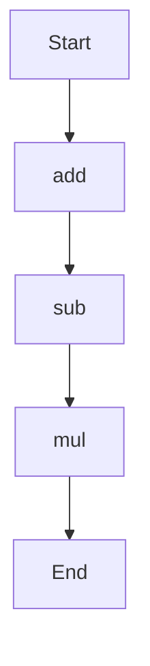

# agentic-test-repo

Auto-documented by Agentic AI Documentation Maintainer.

---

# API Documentation

## calculator.py
The calculator.py file contains a collection of mathematical functions. When run directly, this script does not execute any specific code block, but rather provides a set of functions for external use.

### Functions
#### add(a, b)
##### Description
The `add` function calculates the sum of two numbers.
##### Parameters
* `a` (int or float): The first number to add.
* `b` (int or float): The second number to add.
##### Returns
* `int` or `float`: The sum of `a` and `b`.
##### Example
```python
result = add(5, 7)
print(result)  # Output: 12
```

#### sub(c, d)
##### Description
The `sub` function calculates the difference between two numbers.
##### Parameters
* `c` (int or float): The first number.
* `d` (int or float): The second number to subtract from the first.
##### Returns
* `int` or `float`: The difference between `c` and `d`.
##### Example
```python
result = sub(10, 4)
print(result)  # Output: 6
```

#### mul(a, b)
##### Description
The `mul` function calculates the product of two numbers.
##### Parameters
* `a` (int or float): The first number to multiply.
* `b` (int or float): The second number to multiply.
##### Returns
* `int` or `float`: The product of `a` and `b`.
##### Example
```python
result = mul(5, 6)
print(result)  # Output: 30
```

Since there are multiple functions in this file, the following flowchart illustrates the execution flow when these functions are used in sequence:

```mermaid
flowchart TD
    A[Start] --> B[add]
    B --> C[sub]
    C --> D[mul]
    D --> E[End]
```
Note: This flowchart assumes a sequence where `add` is called first, followed by `sub`, and then `mul`. The actual execution flow may vary based on the specific use case and how these functions are integrated into a larger program.

---

*Last updated automatically by AI on every code push.*
