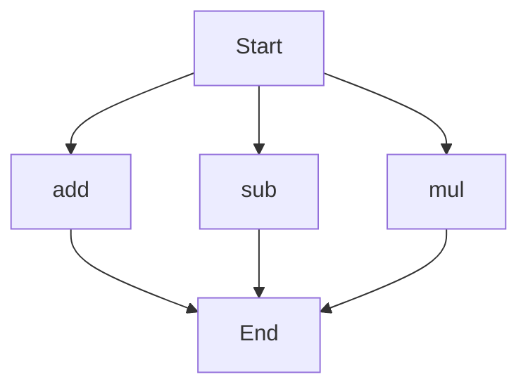

# agentic-test-repo

Auto-documented by Agentic AI Documentation Maintainer.

---

# API Documentation
## calculator.py
### Functions
#### add(a, b)
##### Description
The `add` function calculates the sum of two numbers.

##### Parameters
* `a` (number): The first number to be added.
* `b` (number): The second number to be added.

##### Returns
The sum of `a` and `b`.

##### Example
```python
result = add(5, 7)
print(result)  # Outputs: 12
```

#### sub(c, d)
##### Description
The `sub` function calculates the difference between two numbers.

##### Parameters
* `c` (number): The first number.
* `d` (number): The second number to be subtracted from the first.

##### Returns
The difference between `c` and `d`.

##### Example
```python
result = sub(10, 4)
print(result)  # Outputs: 6
```

#### mul(a, b)
##### Description
The `mul` function calculates the product of two numbers.

##### Parameters
* `a` (number): The first number to be multiplied.
* `b` (number): The second number to be multiplied.

##### Returns
The product of `a` and `b`.

##### Example
```python
result = mul(5, 6)
print(result)  # Outputs: 30
```

### Execution Flow
Since there are multiple functions in this file, the execution flow can be represented as follows:

```mermaid
flowchart TD
    A[Start] --> B[add]
    A --> C[sub]
    A --> D[mul]
    B --> E[End]
    C --> E
    D --> E
```
Note that the execution flow is not strictly sequential, as the functions can be called independently. This flowchart simply illustrates the possible paths of execution.

### Module-Level Code
When run directly, this script does not contain any module-level code, such as print statements or a main block, that would be executed. It is intended to be imported and used as a library of mathematical functions.

---

*Last updated automatically by AI on every code push.*
