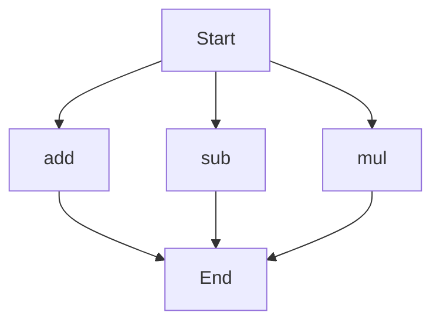

# agentic-test-repo

Auto-documented by Agentic AI Documentation Maintainer.

---

# API Documentation
## calculator.py
### Functions
#### add(a, b)
##### Description
The `add` function takes two parameters, `a` and `b`, and returns their sum. It is used for basic arithmetic addition operations.

##### Parameters
* `a` (number): The first number to add.
* `b` (number): The second number to add.

##### Returns
* `result` (number): The sum of `a` and `b`.

##### Example
```python
result = add(5, 7)
print(result)  # Outputs: 12
```

#### sub(c, d)
##### Description
The `sub` function takes two parameters, `c` and `d`, and returns their difference. It is used for basic arithmetic subtraction operations.

##### Parameters
* `c` (number): The first number.
* `d` (number): The second number to subtract from the first.

##### Returns
* `result` (number): The difference between `c` and `d`.

##### Example
```python
result = sub(10, 4)
print(result)  # Outputs: 6
```

#### mul(a, b)
##### Description
The `mul` function takes two parameters, `a` and `b`, and returns their product. It is used for basic arithmetic multiplication operations.

##### Parameters
* `a` (number): The first number to multiply.
* `b` (number): The second number to multiply.

##### Returns
* `result` (number): The product of `a` and `b`.

##### Example
```python
result = mul(5, 6)
print(result)  # Outputs: 30
```

### Execution Flow

```mermaid
   flowchart TD
       A[Start] --> B[add]
       A --> C[sub]
       A --> D[mul]
       B --> E[End]
       C --> E
       D --> E
```
This flowchart illustrates the possible execution paths of the functions within the `calculator.py` file. The `Start` node represents the beginning of the program, and the `End` node represents the termination. The arrows indicate the potential flow of execution between functions. Note that this is a simplified representation, as the actual execution flow may vary depending on the specific use case and how these functions are called within the program.

---

*Last updated automatically by AI on every code push.*
