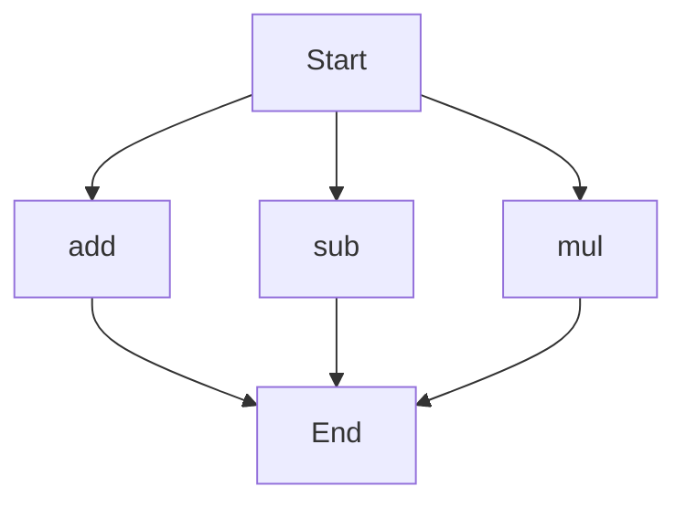

# agentic-test-repo

Auto-documented by Agentic AI Documentation Maintainer.

---

# API Documentation

## calculator.py
This file contains a collection of mathematical functions.

### add(a, b)
#### Description
The `add` function takes two numbers as input and returns their sum.
#### Parameters
* `a` (int or float): The first number to add.
* `b` (int or float): The second number to add.
#### Returns
* `int` or `float`: The sum of `a` and `b`.
#### Example
```python
result = add(3, 5)
print(result)  # Output: 8
```

### sub(c, d)
#### Description
The `sub` function takes two numbers as input and returns their difference.
#### Parameters
* `c` (int or float): The first number.
* `d` (int or float): The second number to subtract from the first.
#### Returns
* `int` or `float`: The difference between `c` and `d`.
#### Example
```python
result = sub(10, 4)
print(result)  # Output: 6
```

### mul(a, b)
#### Description
The `mul` function takes two numbers as input and returns their product.
#### Parameters
* `a` (int or float): The first number to multiply.
* `b` (int or float): The second number to multiply.
#### Returns
* `int` or `float`: The product of `a` and `b`.
#### Example
```python
result = mul(4, 5)
print(result)  # Output: 20
```

Since there are multiple functions in this file, the execution flow can be represented as follows:

```mermaid
flowchart TD
    A[Start] --> B[add]
    A --> C[sub]
    A --> D[mul]
    B --> E[End]
    C --> E
    D --> E
```
Note: The execution flow assumes that the functions can be called independently, and the order of execution may vary based on the specific use case. 

There are no classes or variables in this file. The module-level code is not provided, so there is no description for the script's behavior when run directly.

---

*Last updated automatically by AI on every code push.*
