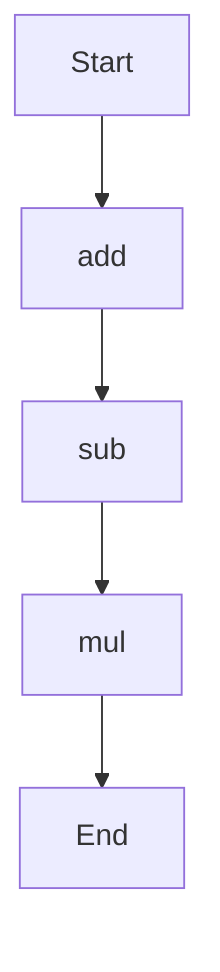

# agentic-test-repo

Auto-documented by Agentic AI Documentation Maintainer.

---

# API Documentation

## calculator.py
The calculator.py file contains a collection of mathematical functions for basic arithmetic operations.

### add(a, b)
#### Description
The `add` function calculates the sum of two numbers.
#### Parameters
* `a` (int or float): The first number to add.
* `b` (int or float): The second number to add.
#### Returns
The sum of `a` and `b`.
#### Example
```python
result = add(5, 7)
print(result)  # Output: 12
```

### sub(c, d)
#### Description
The `sub` function calculates the difference between two numbers.
#### Parameters
* `c` (int or float): The first number.
* `d` (int or float): The second number to subtract from the first.
#### Returns
The difference between `c` and `d`.
#### Example
```python
result = sub(10, 4)
print(result)  # Output: 6
```

### mul(a, b)
#### Description
The `mul` function calculates the product of two numbers.
#### Parameters
* `a` (int or float): The first number to multiply.
* `b` (int or float): The second number to multiply.
#### Returns
The product of `a` and `b`.
#### Example
```python
result = mul(5, 6)
print(result)  # Output: 30
```

Since the calculator.py file contains more than one function, the following flowchart illustrates the execution flow:

```mermaid
   flowchart TD
       A[Start] --> B[add]
       B --> C[sub]
       C --> D[mul]
       D --> E[End]
```
Note: This flowchart represents a linear sequence of function calls. In a real-world application, the execution flow might be more complex and depend on the specific use case. 

There are no classes or variables defined in this file. The script can be used directly to perform basic arithmetic operations by calling the respective functions.

---

*Last updated automatically by AI on every code push.*
