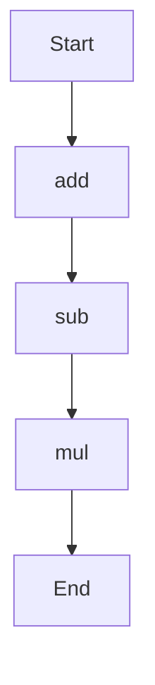

# agentic-test-repo

Auto-documented by Agentic AI Documentation Maintainer.

---

# API Documentation
## calculator.py
### Functions
#### add(a, b)
Description: This function calculates the sum of two numbers.
Parameters:
- a (int or float): The first number to add.
- b (int or float): The second number to add.
Returns: The sum of a and b.
Example: 
```python
result = add(5, 7)
print(result)  # Outputs: 12
```

#### sub(c, d)
Description: This function calculates the difference between two numbers.
Parameters:
- c (int or float): The first number.
- d (int or float): The second number to subtract.
Returns: The difference between c and d.
Example: 
```python
result = sub(10, 4)
print(result)  # Outputs: 6
```

#### mul(a, b)
Description: This function calculates the product of two numbers.
Parameters:
- a (int or float): The first number to multiply.
- b (int or float): The second number to multiply.
Returns: The product of a and b.
Example: 
```python
result = mul(5, 7)
print(result)  # Outputs: 35
```

### Execution Flow
Since there are multiple functions in this file, here's a high-level overview of how they might be used in sequence:

```mermaid
flowchart TD
    A[Start] --> B[add]
    B --> C[sub]
    C --> D[mul]
    D --> E[End]
```
Note: The above flowchart represents one possible sequence of function calls. In a real-world application, the actual flow might vary based on the specific requirements and use cases.

### Module-Level Code
When run directly, this script does not execute any specific code, as it only defines functions. To use these functions, you would need to import them into another script or call them from within this script after defining them. 

No variables or classes are defined in this file.

---

*Last updated automatically by AI on every code push.*
