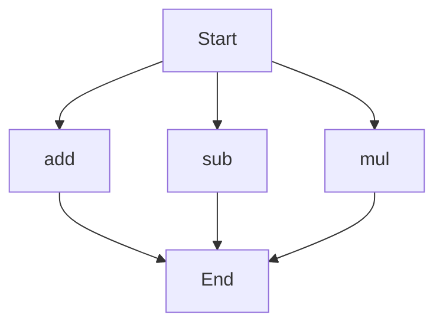

# agentic-test-repo

Auto-documented by Agentic AI Documentation Maintainer.

---

# API Documentation

## calculator.py
### Overview
The calculator.py file contains a collection of mathematical functions for basic arithmetic operations.

### Functions

#### add(a, b)
##### Description
The `add` function calculates the sum of two numbers.
##### Parameters
* `a`: The first number to add.
* `b`: The second number to add.
##### Returns
The sum of `a` and `b`.
##### Example
```python
result = add(5, 3)
print(result)  # Outputs: 8
```

#### sub(c, d)
##### Description
The `sub` function calculates the difference of two numbers.
##### Parameters
* `c`: The first number.
* `d`: The second number to subtract from the first.
##### Returns
The difference of `c` and `d`.
##### Example
```python
result = sub(10, 4)
print(result)  # Outputs: 6
```

#### mul(a, b)
##### Description
The `mul` function calculates the product of two numbers.
##### Parameters
* `a`: The first number to multiply.
* `b`: The second number to multiply.
##### Returns
The product of `a` and `b`.
##### Example
```python
result = mul(7, 2)
print(result)  # Outputs: 14
```

### Execution Flow
Since there are multiple functions in this file, the execution flow can be represented as follows:

```mermaid
flowchart TD
    A[Start] --> B[add]
    A --> C[sub]
    A --> D[mul]
    B --> E[End]
    C --> E
    D --> E
```
Note: The execution flow is not strictly linear, as the functions can be called independently.

### Module-Level Code
When run directly, this script does not execute any specific code, as it only contains function definitions. To use the functions, they must be called explicitly, as shown in the examples above.

---

*Last updated automatically by AI on every code push.*
