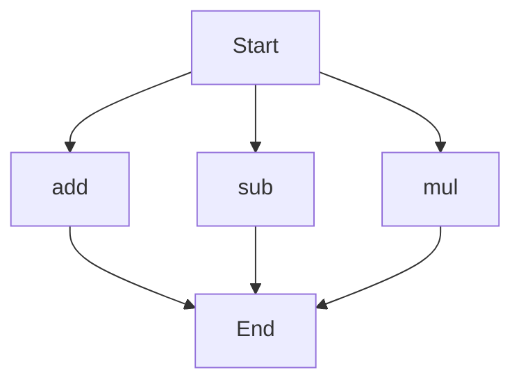

# agentic-test-repo

Auto-documented by Agentic AI Documentation Maintainer.

---

# API Documentation
## calculator.py
The calculator.py module provides basic arithmetic operations.

### Functions
#### add(a, b)
Description: This function adds two numbers together.
Parameters:
* `a` (int or float): The first number to add.
* `b` (int or float): The second number to add.
Returns: The sum of `a` and `b`.
Example:
```python
result = add(3, 5)
print(result)  # Outputs: 8
```

#### sub(c, d)
Description: This function subtracts one number from another.
Parameters:
* `c` (int or float): The number to subtract from.
* `d` (int or float): The number to subtract.
Returns: The difference between `c` and `d`.
Example:
```python
result = sub(10, 4)
print(result)  # Outputs: 6
```

#### mul(a, b)
Description: This function multiplies two numbers together.
Parameters:
* `a` (int or float): The first number to multiply.
* `b` (int or float): The second number to multiply.
Returns: The product of `a` and `b`.
Example:
```python
result = mul(4, 5)
print(result)  # Outputs: 20
```

### Execution Flow
Since there are multiple functions in this module, the execution flow is as follows:

```mermaid
flowchart TD
    A[Start] --> B[add]
    A --> C[sub]
    A --> D[mul]
    B --> E[End]
    C --> E
    D --> E
```
Note: The execution flow is not strictly sequential, as the functions can be called independently. This flowchart represents the possible entry points into the module.

### Module-Level Code
When run directly, this script does not execute any specific code, as it only defines functions. To use the functions, import the module and call the desired function.

---

*Last updated automatically by AI on every code push.*
