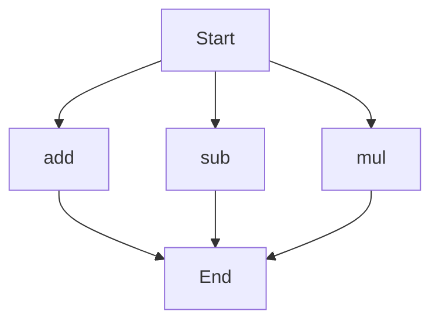

# agentic-test-repo

Auto-documented by Agentic AI Documentation Maintainer.

---

# API Documentation

## calculator.py
### Overview
The `calculator.py` file contains a set of basic arithmetic functions.

### Functions
#### add(a, b)
##### Description
The `add` function takes two numbers as input and returns their sum.
##### Parameters
* `a`: The first number to add.
* `b`: The second number to add.
##### Returns
The sum of `a` and `b`.
##### Example
```python
result = add(3, 5)
print(result)  # Output: 8
```

#### sub(c, d)
##### Description
The `sub` function takes two numbers as input and returns their difference.
##### Parameters
* `c`: The first number.
* `d`: The second number to subtract from the first.
##### Returns
The difference between `c` and `d`.
##### Example
```python
result = sub(10, 4)
print(result)  # Output: 6
```

#### mul(a, b)
##### Description
The `mul` function takes two numbers as input and returns their product.
##### Parameters
* `a`: The first number to multiply.
* `b`: The second number to multiply.
##### Returns
The product of `a` and `b`.
##### Example
```python
result = mul(4, 5)
print(result)  # Output: 20
```

### Execution Flow
Since `calculator.py` contains more than one function, the execution flow can be represented as follows:

```mermaid
flowchart TD
    A[Start] --> B[add]
    A --> C[sub]
    A --> D[mul]
    B --> E[End]
    C --> E
    D --> E
```
Note: This flowchart indicates that the functions can be called independently, and the order of execution depends on the user's needs.

### Module-Level Code
When run directly, the `calculator.py` script does not execute any specific code, as it only defines functions. To use these functions, you need to import the module in another script or call the functions directly in the `calculator.py` file.

No classes or variables are defined in this module.

---

*Last updated automatically by AI on every code push.*
