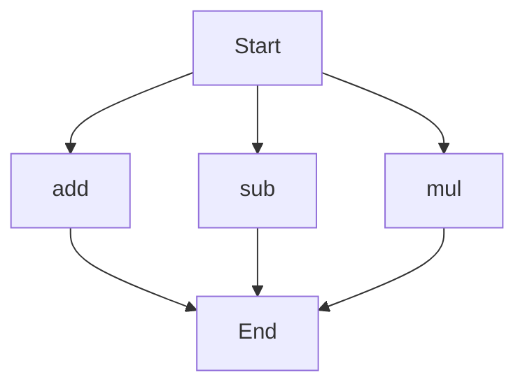

# agentic-test-repo

Auto-documented by Agentic AI Documentation Maintainer.

---

# API Documentation
## calculator.py
### Function: add(a, b)
#### Description
The `add` function calculates the sum of two numbers.
#### Parameters
* `a` (number): The first number to add.
* `b` (number): The second number to add.
#### Returns
The sum of `a` and `b`.
#### Example
```python
result = add(5, 3)
print(result)  # Outputs: 8
```

### Function: sub(c, d)
#### Description
The `sub` function calculates the difference of two numbers.
#### Parameters
* `c` (number): The first number.
* `d` (number): The second number to subtract.
#### Returns
The difference of `c` and `d`.
#### Example
```python
result = sub(10, 4)
print(result)  # Outputs: 6
```

### Function: mul(a, b)
#### Description
The `mul` function calculates the product of two numbers.
#### Parameters
* `a` (number): The first number to multiply.
* `b` (number): The second number to multiply.
#### Returns
The product of `a` and `b`.
#### Example
```python
result = mul(5, 6)
print(result)  # Outputs: 30
```

### Execution Flow
Since there are multiple functions in this file, the following flowchart illustrates the execution flow:

```mermaid
flowchart TD
    A[Start] --> B[add]
    A --> C[sub]
    A --> D[mul]
    B --> E[End]
    C --> E
    D --> E
```
Note: The execution flow is not strictly sequential, as the order of function calls depends on the specific use case. This flowchart is meant to provide a general overview of the functions available in the `calculator.py` file.

---

*Last updated automatically by AI on every code push.*
