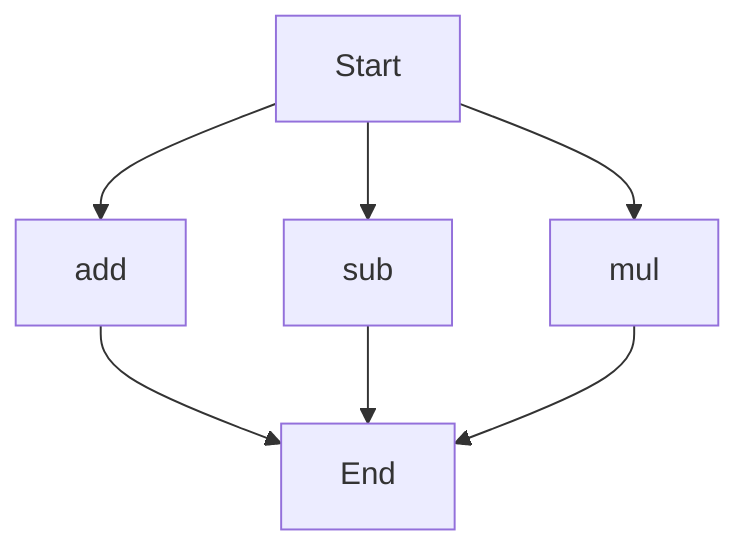

# agentic-test-repo

Auto-documented by Agentic AI Documentation Maintainer.

---

# API Documentation
## calculator.py
The calculator.py file contains a set of mathematical functions that can be used to perform basic arithmetic operations.

### add(a, b)
#### Description
The add function calculates the sum of two numbers.
#### Parameters
* a (int or float): The first number to add.
* b (int or float): The second number to add.
#### Returns
The sum of a and b.
#### Example
```python
result = add(5, 7)
print(result)  # Outputs: 12
```

### sub(c, d)
#### Description
The sub function calculates the difference between two numbers.
#### Parameters
* c (int or float): The first number.
* d (int or float): The second number to subtract from the first.
#### Returns
The difference between c and d.
#### Example
```python
result = sub(10, 4)
print(result)  # Outputs: 6
```

### mul(a, b)
#### Description
The mul function calculates the product of two numbers.
#### Parameters
* a (int or float): The first number to multiply.
* b (int or float): The second number to multiply.
#### Returns
The product of a and b.
#### Example
```python
result = mul(6, 9)
print(result)  # Outputs: 54
```

Since the calculator.py file contains more than one function, the execution flow can be represented as follows:

```mermaid
flowchart TD
    A[Start] --> B[add]
    A --> C[sub]
    A --> D[mul]
    B --> E[End]
    C --> E
    D --> E
```
This flowchart shows that the script starts and can execute any of the three functions: add, sub, or mul, before ending. 

Note: There are no classes or variables in this file. If there were, they would be documented according to the provided rules.

---

*Last updated automatically by AI on every code push.*
