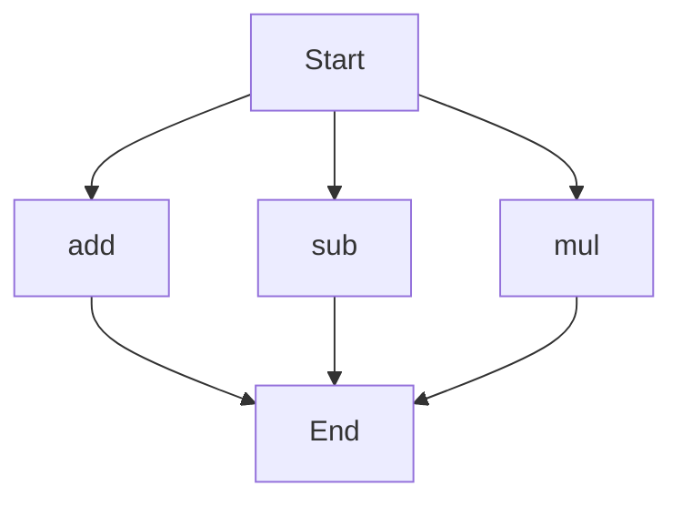

# agentic-test-repo

Auto-documented by Agentic AI Documentation Maintainer.

---

# API Documentation
## calculator.py
The calculator.py file contains a set of basic arithmetic functions.

### Functions
#### add(a, b)
##### Description
The `add` function calculates the sum of two numbers.

##### Parameters
* `a` (int or float): The first number to be added.
* `b` (int or float): The second number to be added.

##### Returns
* `int` or `float`: The sum of `a` and `b`.

##### Example
```python
result = add(5, 3)
print(result)  # Output: 8
```

#### sub(c, d)
##### Description
The `sub` function calculates the difference of two numbers.

##### Parameters
* `c` (int or float): The first number.
* `d` (int or float): The second number to be subtracted.

##### Returns
* `int` or `float`: The difference of `c` and `d`.

##### Example
```python
result = sub(10, 4)
print(result)  # Output: 6
```

#### mul(a, b)
##### Description
The `mul` function calculates the product of two numbers.

##### Parameters
* `a` (int or float): The first number to be multiplied.
* `b` (int or float): The second number to be multiplied.

##### Returns
* `int` or `float`: The product of `a` and `b`.

##### Example
```python
result = mul(7, 2)
print(result)  # Output: 14
```

### Execution Flow
Since there are multiple functions in this file, the execution flow can be visualized as follows:

```mermaid
flowchart TD
    A[Start] --> B[add]
    A --> C[sub]
    A --> D[mul]
    B --> E[End]
    C --> E
    D --> E
```
This flowchart shows that the execution starts at the beginning of the script, and then can proceed to any of the functions (`add`, `sub`, or `mul`) before reaching the end.

### Module-Level Code
When run directly, this script does not contain any module-level code, such as print statements or a main block, that would execute when the script is invoked. The functions provided can be imported and used in other scripts as needed.

---

*Last updated automatically by AI on every code push.*
