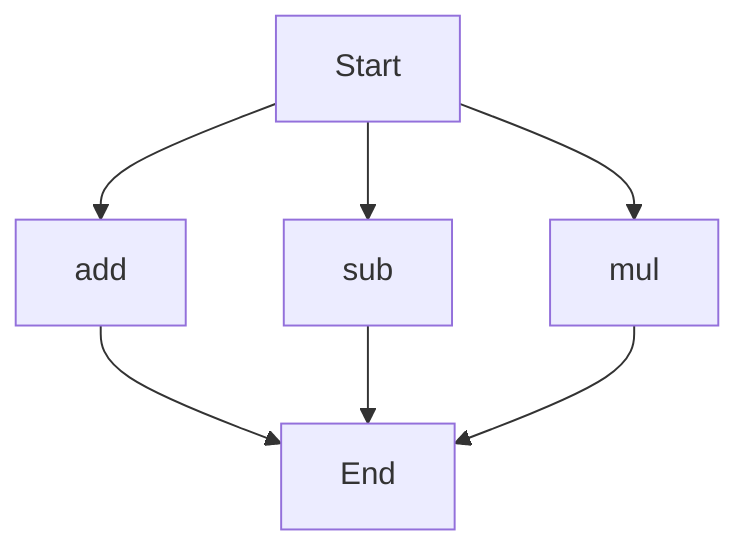

# agentic-test-repo

Auto-documented by Agentic AI Documentation Maintainer.

---

# API Documentation

## calculator.py
The `calculator.py` file contains a collection of mathematical functions that can be used to perform basic arithmetic operations.

### add(a, b)
#### Description
The `add(a, b)` function calculates the sum of two numbers.
#### Parameters
* `a`: The first number to add.
* `b`: The second number to add.
#### Returns
The sum of `a` and `b`.
#### Example
```python
result = add(5, 3)
print(result)  # Outputs: 8
```

### sub(c, d)
#### Description
The `sub(c, d)` function calculates the difference between two numbers.
#### Parameters
* `c`: The first number.
* `d`: The second number to subtract from the first.
#### Returns
The difference between `c` and `d`.
#### Example
```python
result = sub(10, 4)
print(result)  # Outputs: 6
```

### mul(a, b)
#### Description
The `mul(a, b)` function calculates the product of two numbers.
#### Parameters
* `a`: The first number to multiply.
* `b`: The second number to multiply.
#### Returns
The product of `a` and `b`.
#### Example
```python
result = mul(5, 6)
print(result)  # Outputs: 30
```

Since `calculator.py` contains more than one function, the following flowchart illustrates the execution flow:

```mermaid
flowchart TD
    A[Start] --> B[add]
    A --> C[sub]
    A --> D[mul]
    B --> E[End]
    C --> E
    D --> E
```
This script does not contain any module-level code or classes. When run directly, it does not perform any operations without being imported and used in another script.

---

*Last updated automatically by AI on every code push.*
