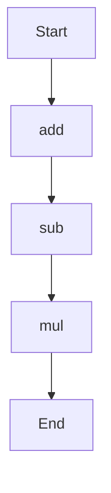

# agentic-test-repo

Auto-documented by Agentic AI Documentation Maintainer.

---

# API Documentation

## calculator.py
The calculator.py file contains a set of mathematical functions to perform basic arithmetic operations.

### add(a, b)
#### Description
The `add` function calculates the sum of two numbers.

#### Parameters
* `a` (int/float): The first number to add.
* `b` (int/float): The second number to add.

#### Returns
The sum of `a` and `b`.

#### Example
```python
result = add(5, 7)
print(result)  # Outputs: 12
```

### sub(c, d)
#### Description
The `sub` function calculates the difference of two numbers.

#### Parameters
* `c` (int/float): The first number.
* `d` (int/float): The second number to subtract from the first.

#### Returns
The difference of `c` and `d`.

#### Example
```python
result = sub(10, 4)
print(result)  # Outputs: 6
```

### mul(a, b)
#### Description
The `mul` function calculates the product of two numbers.

#### Parameters
* `a` (int/float): The first number to multiply.
* `b` (int/float): The second number to multiply.

#### Returns
The product of `a` and `b`.

#### Example
```python
result = mul(3, 9)
print(result)  # Outputs: 27
```

Since the calculator.py file contains more than one function, here is a Mermaid flowchart showing the execution flow:

```mermaid
flowchart TD
    A[Start] --> B[add]
    B --> C[sub]
    C --> D[mul]
    D --> E[End]
```
Note: This flowchart is a simple representation and does not reflect the actual execution order, as it depends on how the functions are called in the script. 

When run directly, the calculator.py script does not have any specific behavior, as it only contains function definitions. To use these functions, you would need to import this module in another script or call the functions directly in the calculator.py file.

---

*Last updated automatically by AI on every code push.*
