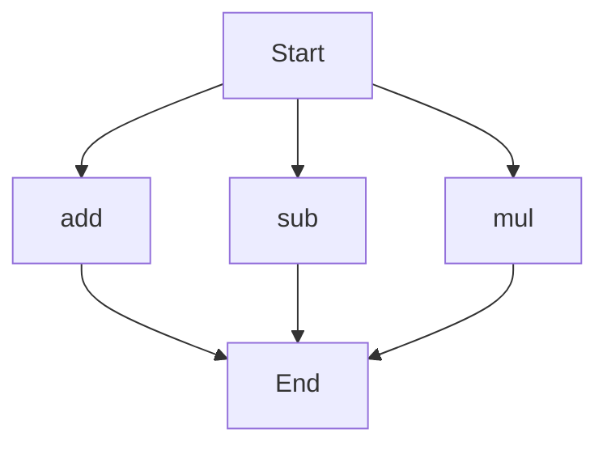

# agentic-test-repo

Auto-documented by Agentic AI Documentation Maintainer.

---

# API Documentation

## calculator.py
The calculator.py file contains a collection of mathematical functions that can be used to perform basic arithmetic operations.

### add(a, b)
#### Description
The `add(a, b)` function calculates the sum of two numbers.
#### Parameters
* `a` (number): The first number to add.
* `b` (number): The second number to add.
#### Returns
The sum of `a` and `b`.
#### Example
```python
result = add(5, 3)
print(result)  # Output: 8
```

### sub(c, d)
#### Description
The `sub(c, d)` function calculates the difference between two numbers.
#### Parameters
* `c` (number): The first number.
* `d` (number): The second number to subtract from the first.
#### Returns
The difference between `c` and `d`.
#### Example
```python
result = sub(10, 4)
print(result)  # Output: 6
```

### mul(a, b)
#### Description
The `mul(a, b)` function calculates the product of two numbers.
#### Parameters
* `a` (number): The first number to multiply.
* `b` (number): The second number to multiply.
#### Returns
The product of `a` and `b`.
#### Example
```python
result = mul(5, 6)
print(result)  # Output: 30
```

Since the calculator.py file contains more than one function, the execution flow can be represented as follows:

```mermaid
flowchart TD
    A[Start] --> B[add]
    A --> C[sub]
    A --> D[mul]
    B --> E[End]
    C --> E
    D --> E
```
Note: The flowchart shows that the execution can start with any of the three functions (`add`, `sub`, or `mul`) and will end after the function is executed. 

When run directly, the script does not have any specific behavior as it only contains function definitions. To use these functions, you would need to call them from another script or from an interactive Python environment.

---

*Last updated automatically by AI on every code push.*
