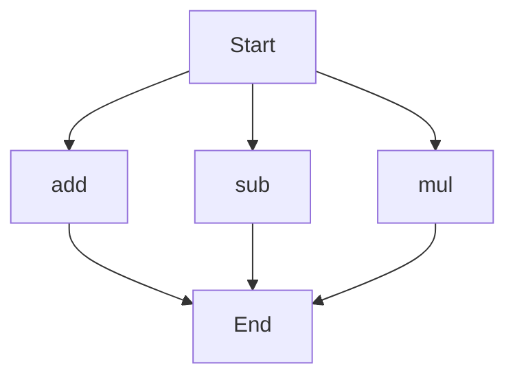

# agentic-test-repo

Auto-documented by Agentic AI Documentation Maintainer.

---

# API Documentation
## calculator.py
### Description of calculator.py
The calculator.py file contains a collection of mathematical functions to perform addition, subtraction, and multiplication operations.

### Functions
#### add(a, b)
##### Description
The `add` function calculates the sum of two numbers.
##### Parameters
* `a` (int or float): The first number to add.
* `b` (int or float): The second number to add.
##### Returns
* `int` or `float`: The sum of `a` and `b`.
##### Example
```python
result = add(5, 7)
print(result)  # Output: 12
```

#### sub(c, d)
##### Description
The `sub` function calculates the difference of two numbers.
##### Parameters
* `c` (int or float): The first number.
* `d` (int or float): The second number to subtract.
##### Returns
* `int` or `float`: The difference of `c` and `d`.
##### Example
```python
result = sub(10, 4)
print(result)  # Output: 6
```

#### mul(a, b)
##### Description
The `mul` function calculates the product of two numbers.
##### Parameters
* `a` (int or float): The first number to multiply.
* `b` (int or float): The second number to multiply.
##### Returns
* `int` or `float`: The product of `a` and `b`.
##### Example
```python
result = mul(6, 9)
print(result)  # Output: 54
```

### Execution Flow
Since there are multiple functions in this file, here is a high-level overview of the execution flow:

```mermaid
    flowchart TD
        A[Start] --> B[add]
        A --> C[sub]
        A --> D[mul]
        B --> E[End]
        C --> E
        D --> E
```
Note: This flowchart illustrates the possible execution paths when using the functions in this module. The actual execution flow depends on how the functions are called and used in the program. 

No classes or variables were found in this file. The provided functions can be used as building blocks for more complex mathematical operations or as part of a larger application.

---

*Last updated automatically by AI on every code push.*
