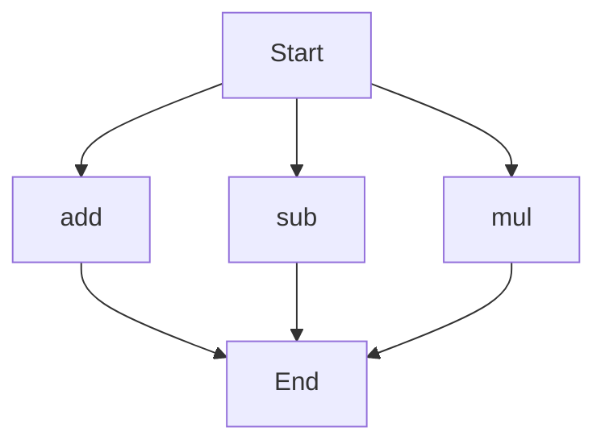

# agentic-test-repo

Auto-documented by Agentic AI Documentation Maintainer.

---

# API Documentation

## calculator.py
The calculator.py file contains a set of mathematical functions that can be used to perform basic arithmetic operations. When run directly, this script does not execute any specific code as it only contains function definitions.

### Functions
#### add(a, b)
##### Description
The `add` function takes two parameters and returns their sum. It is used to perform basic addition.

##### Parameters
* `a` (int or float): The first number to be added.
* `b` (int or float): The second number to be added.

##### Returns
* `int` or `float`: The sum of `a` and `b`.

##### Example
```python
result = add(5, 7)
print(result)  # Outputs: 12
```

#### sub(c, d)
##### Description
The `sub` function takes two parameters and returns their difference. It is used to perform basic subtraction.

##### Parameters
* `c` (int or float): The first number.
* `d` (int or float): The second number to be subtracted from the first.

##### Returns
* `int` or `float`: The difference between `c` and `d`.

##### Example
```python
result = sub(10, 4)
print(result)  # Outputs: 6
```

#### mul(a, b)
##### Description
The `mul` function takes two parameters and returns their product. It is used to perform basic multiplication.

##### Parameters
* `a` (int or float): The first number to be multiplied.
* `b` (int or float): The second number to be multiplied.

##### Returns
* `int` or `float`: The product of `a` and `b`.

##### Example
```python
result = mul(5, 6)
print(result)  # Outputs: 30
```

### Execution Flow
Since there are multiple functions in this file, the following flowchart illustrates a possible execution flow. Note that the actual flow depends on how these functions are called and used in a larger program.

```mermaid
flowchart TD
    A[Start] --> B[add]
    A --> C[sub]
    A --> D[mul]
    B --> E[End]
    C --> E
    D --> E
```
This flowchart shows that the execution starts with the `add`, `sub`, or `mul` function, and ends after one of these functions completes. In a real-world scenario, these functions would likely be called from other parts of a program, and the flow would be more complex.

---

*Last updated automatically by AI on every code push.*
