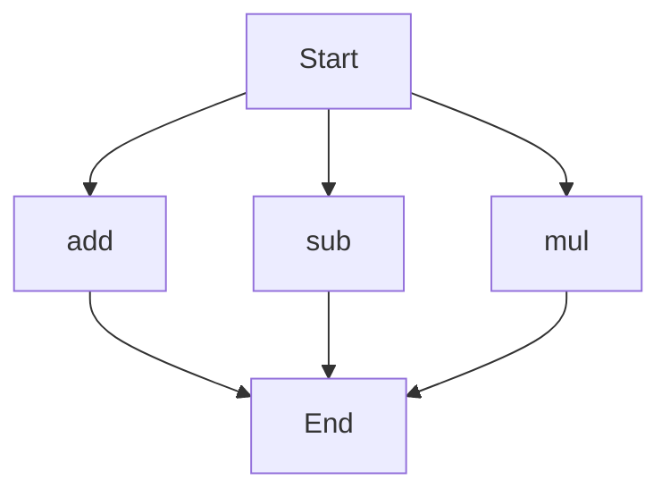

# agentic-test-repo

Auto-documented by Agentic AI Documentation Maintainer.

---

# API Documentation
## calculator.py
The calculator.py file contains a set of basic arithmetic functions. 

### add(a, b)
#### Description
The `add` function calculates the sum of two numbers.
#### Parameters
* `a`: The first number to add.
* `b`: The second number to add.
#### Returns
The sum of `a` and `b`.
#### Example
```python
result = add(5, 3)
print(result)  # Outputs: 8
```

### sub(c, d)
#### Description
The `sub` function calculates the difference between two numbers.
#### Parameters
* `c`: The first number.
* `d`: The second number to subtract from the first.
#### Returns
The difference between `c` and `d`.
#### Example
```python
result = sub(10, 4)
print(result)  # Outputs: 6
```

### mul(a, b)
#### Description
The `mul` function calculates the product of two numbers.
#### Parameters
* `a`: The first number to multiply.
* `b`: The second number to multiply.
#### Returns
The product of `a` and `b`.
#### Example
```python
result = mul(7, 2)
print(result)  # Outputs: 14
```

Since the calculator.py file has more than one function, the following flowchart describes the execution flow:

```mermaid
flowchart TD
    A[Start] --> B[add]
    A --> C[sub]
    A --> D[mul]
    B --> E[End]
    C --> E
    D --> E
```
When run directly, this script does not contain any module-level code, so there is no main execution block to describe.

---

*Last updated automatically by AI on every code push.*
