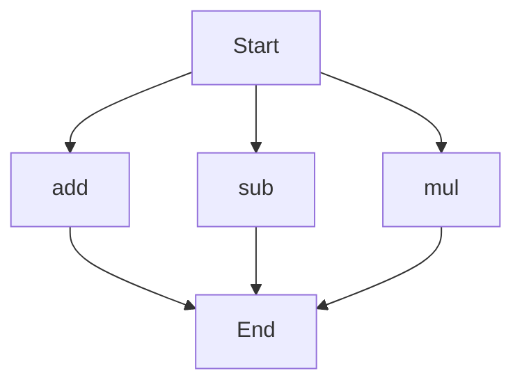

# agentic-test-repo

Auto-documented by Agentic AI Documentation Maintainer.

---

# API Documentation
## calculator.py
The calculator.py file contains a set of basic arithmetic functions. 

### add(a, b)
#### Description
The add function takes two parameters and returns their sum.
#### Parameters
* a (number): The first number to be added
* b (number): The second number to be added
#### Returns
The sum of a and b
#### Example
```python
result = add(5, 7)
print(result)  # Outputs: 12
```

### sub(c, d)
#### Description
The sub function takes two parameters and returns their difference.
#### Parameters
* c (number): The first number
* d (number): The second number to be subtracted from the first
#### Returns
The difference between c and d
#### Example
```python
result = sub(10, 4)
print(result)  # Outputs: 6
```

### mul(a, b)
#### Description
The mul function takes two parameters and returns their product.
#### Parameters
* a (number): The first number to be multiplied
* b (number): The second number to be multiplied
#### Returns
The product of a and b
#### Example
```python
result = mul(6, 9)
print(result)  # Outputs: 54
```

Since there are multiple functions in this file, here is a flowchart showing the execution flow:

```mermaid
flowchart TD
    A[Start] --> B[add]
    A --> C[sub]
    A --> D[mul]
    B --> E[End]
    C --> E
    D --> E
```
When run directly, this script does not have any specific functionality as it only contains function definitions. It is designed to be imported and used in other scripts.

---

*Last updated automatically by AI on every code push.*
