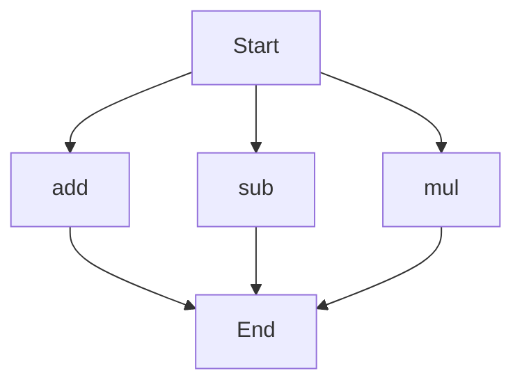

# agentic-test-repo

Auto-documented by Agentic AI Documentation Maintainer.

---

# API Documentation
## calculator.py
### Functions
#### add(a, b)
##### Description
The `add` function calculates the sum of two numbers.

##### Parameters
* `a` (int or float): The first number to add.
* `b` (int or float): The second number to add.

##### Returns
The sum of `a` and `b`.

##### Example
```python
result = add(5, 7)
print(result)  # Output: 12
```

#### sub(c, d)
##### Description
The `sub` function calculates the difference between two numbers.

##### Parameters
* `c` (int or float): The first number.
* `d` (int or float): The second number to subtract.

##### Returns
The difference between `c` and `d`.

##### Example
```python
result = sub(10, 4)
print(result)  # Output: 6
```

#### mul(a, b)
##### Description
The `mul` function calculates the product of two numbers.

##### Parameters
* `a` (int or float): The first number to multiply.
* `b` (int or float): The second number to multiply.

##### Returns
The product of `a` and `b`.

##### Example
```python
result = mul(5, 6)
print(result)  # Output: 30
```

### Execution Flow
Since there are multiple functions in this file, the execution flow can be represented as follows:

```mermaid
flowchart TD
    A[Start] --> B[add]
    A --> C[sub]
    A --> D[mul]
    B --> E[End]
    C --> E
    D --> E
```
Note: The actual execution flow may vary depending on how these functions are called in the code. This flowchart represents a possible scenario where each function is called separately.

### Module-Level Code
This script does not contain any module-level code. It only defines functions for basic arithmetic operations. 

Note: To use these functions, you would need to import this module in another script or call them directly if this script is run directly. For example:
```python
# In another script
from calculator import add, sub, mul

result1 = add(5, 7)
result2 = sub(10, 4)
result3 = mul(5, 6)

print(result1)  # Output: 12
print(result2)  # Output: 6
print(result3)  # Output: 30
```

---

*Last updated automatically by AI on every code push.*
