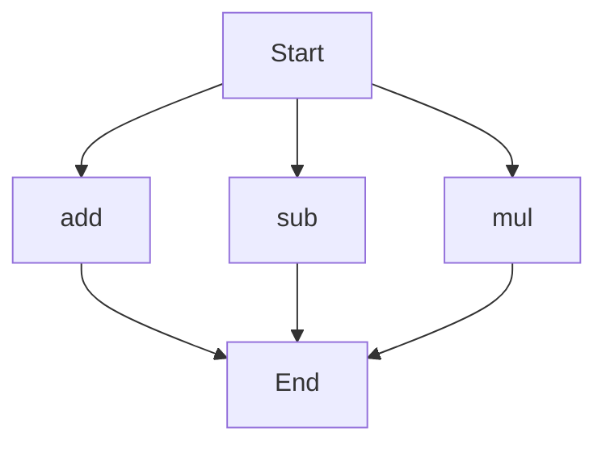

# agentic-test-repo

Auto-documented by Agentic AI Documentation Maintainer.

---

# API Documentation

## calculator.py
### Overview
The `calculator.py` file contains a set of basic arithmetic functions.

### Functions

#### add(a, b)
##### Description
The `add` function calculates the sum of two numbers.

##### Parameters
* `a` (int/float): The first number to add.
* `b` (int/float): The second number to add.

##### Returns
* `int/float`: The sum of `a` and `b`.

##### Example
```python
result = add(5, 7)
print(result)  # Outputs: 12
```

#### sub(c, d)
##### Description
The `sub` function calculates the difference between two numbers.

##### Parameters
* `c` (int/float): The first number.
* `d` (int/float): The second number to subtract from the first.

##### Returns
* `int/float`: The difference between `c` and `d`.

##### Example
```python
result = sub(10, 4)
print(result)  # Outputs: 6
```

#### mul(a, b)
##### Description
The `mul` function calculates the product of two numbers.

##### Parameters
* `a` (int/float): The first number to multiply.
* `b` (int/float): The second number to multiply.

##### Returns
* `int/float`: The product of `a` and `b`.

##### Example
```python
result = mul(6, 9)
print(result)  # Outputs: 54
```

### Execution Flow
Since there are multiple functions in this file, the execution flow can be represented as follows:

```mermaid
flowchart TD
    A[Start] --> B[add]
    A --> C[sub]
    A --> D[mul]
    B --> E[End]
    C --> E
    D --> E
```
Note that the actual execution flow may vary depending on how these functions are called in the program.

### Module-Level Code
When run directly, this script does not have any module-level code. It only defines the arithmetic functions for use in other parts of the program.

---

*Last updated automatically by AI on every code push.*
