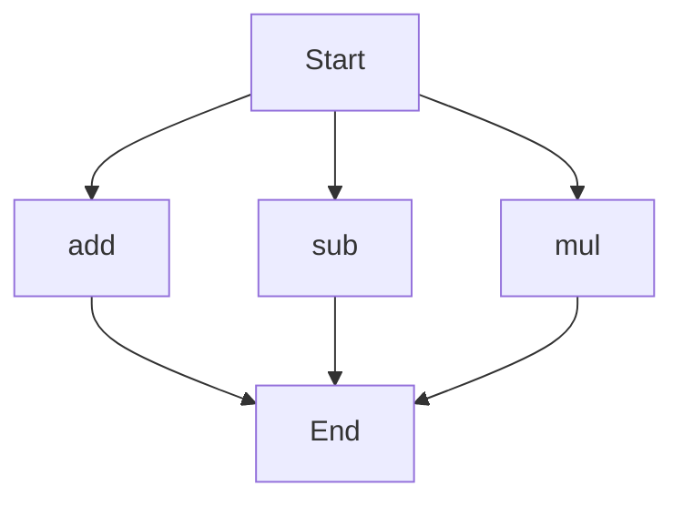

# agentic-test-repo

Auto-documented by Agentic AI Documentation Maintainer.

---

# API Documentation
## calculator.py
The `calculator.py` file contains a collection of mathematical functions that can be used to perform basic arithmetic operations.

### add(a, b)
#### Description
The `add` function takes two numbers as input and returns their sum.

#### Parameters
* `a` (number): The first number to add.
* `b` (number): The second number to add.

#### Returns
* `number`: The sum of `a` and `b`.

#### Example
```python
result = add(2, 3)
print(result)  # Output: 5
```

### sub(c, d)
#### Description
The `sub` function takes two numbers as input and returns their difference.

#### Parameters
* `c` (number): The first number.
* `d` (number): The second number to subtract from the first.

#### Returns
* `number`: The difference between `c` and `d`.

#### Example
```python
result = sub(5, 2)
print(result)  # Output: 3
```

### mul(a, b)
#### Description
The `mul` function takes two numbers as input and returns their product.

#### Parameters
* `a` (number): The first number to multiply.
* `b` (number): The second number to multiply.

#### Returns
* `number`: The product of `a` and `b`.

#### Example
```python
result = mul(4, 5)
print(result)  # Output: 20
```

Since there are multiple functions in this file, here is a Mermaid flowchart showing the execution flow:

```mermaid
flowchart TD
    A[Start] --> B[add]
    A --> C[sub]
    A --> D[mul]
    B --> E[End]
    C --> E
    D --> E
```
Note: The flowchart shows the possible execution paths for each function, but it does not imply a specific order of execution. In a real-world scenario, the execution flow would depend on the specific use case and how the functions are called.

---

*Last updated automatically by AI on every code push.*
