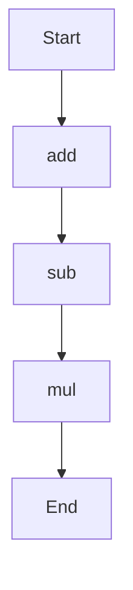

# agentic-test-repo

Auto-documented by Agentic AI Documentation Maintainer.

---

# API Documentation
## calculator.py
The calculator.py file contains a set of basic mathematical functions.

### add(a, b)
#### Description
The `add` function takes two numbers as input and returns their sum.

#### Parameters
* `a` (int/float): The first number to be added.
* `b` (int/float): The second number to be added.

#### Returns
* `int/float`: The sum of `a` and `b`.

#### Example
```python
result = add(5, 7)
print(result)  # Outputs: 12
```

### sub(c, d)
#### Description
The `sub` function takes two numbers as input and returns their difference.

#### Parameters
* `c` (int/float): The first number.
* `d` (int/float): The second number to be subtracted from the first.

#### Returns
* `int/float`: The difference between `c` and `d`.

#### Example
```python
result = sub(10, 4)
print(result)  # Outputs: 6
```

### mul(a, b)
#### Description
The `mul` function takes two numbers as input and returns their product.

#### Parameters
* `a` (int/float): The first number to be multiplied.
* `b` (int/float): The second number to be multiplied.

#### Returns
* `int/float`: The product of `a` and `b`.

#### Example
```python
result = mul(3, 9)
print(result)  # Outputs: 27
```

Since there are multiple functions in this file, the following flowchart illustrates the execution flow:

```mermaid
flowchart TD
    A[Start] --> B[add]
    B --> C[sub]
    C --> D[mul]
    D --> E[End]
```
Note: When run directly, this script does not execute any specific code as it only contains function definitions. To use these functions, you would need to call them in your own code or in an interactive Python environment.

---

*Last updated automatically by AI on every code push.*
