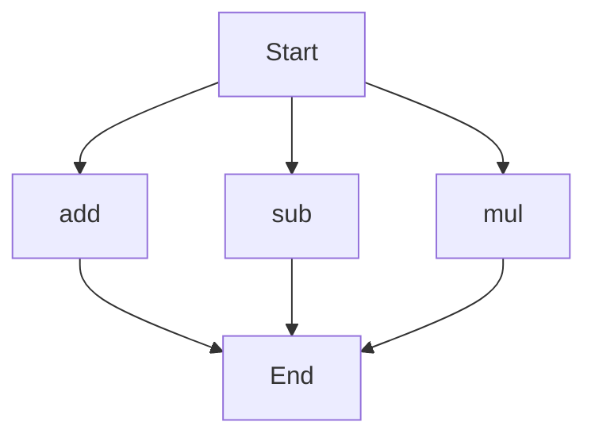

# agentic-test-repo

Auto-documented by Agentic AI Documentation Maintainer.

---

# API Documentation
## calculator.py
The calculator.py file contains a set of mathematical functions that can be used to perform basic arithmetic operations.

### add(a, b)
#### Description
The `add` function takes two parameters, `a` and `b`, and returns their sum.
#### Parameters
* `a` (int or float): The first number to be added.
* `b` (int or float): The second number to be added.
#### Returns
* `int` or `float`: The sum of `a` and `b`.
#### Example
```python
result = add(5, 7)
print(result)  # Outputs: 12
```

### sub(c, d)
#### Description
The `sub` function takes two parameters, `c` and `d`, and returns their difference.
#### Parameters
* `c` (int or float): The first number.
* `d` (int or float): The second number to be subtracted from `c`.
#### Returns
* `int` or `float`: The difference between `c` and `d`.
#### Example
```python
result = sub(10, 4)
print(result)  # Outputs: 6
```

### mul(a, b)
#### Description
The `mul` function takes two parameters, `a` and `b`, and returns their product.
#### Parameters
* `a` (int or float): The first number to be multiplied.
* `b` (int or float): The second number to be multiplied.
#### Returns
* `int` or `float`: The product of `a` and `b`.
#### Example
```python
result = mul(5, 6)
print(result)  # Outputs: 30
```

Since the calculator.py file contains more than one function, the following flowchart illustrates the execution flow of these functions:

```mermaid
flowchart TD
    A[Start] --> B[add]
    A --> C[sub]
    A --> D[mul]
    B --> E[End]
    C --> E
    D --> E
```
Note: This flowchart is a simplified representation and does not account for the specific usage or control flow of the functions in the calculator.py file. It only illustrates the possible execution paths of the functions. 

When run directly, the calculator.py script does not have any specific functionality, as it only contains function definitions. The functions can be imported and used in other scripts to perform arithmetic operations.

---

*Last updated automatically by AI on every code push.*
